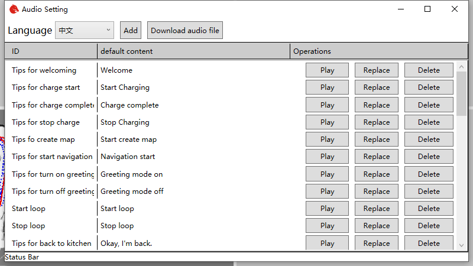
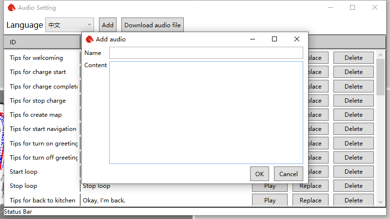
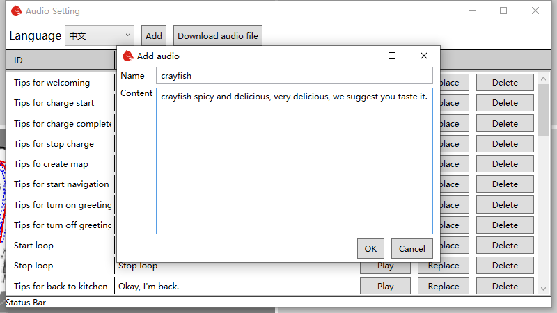
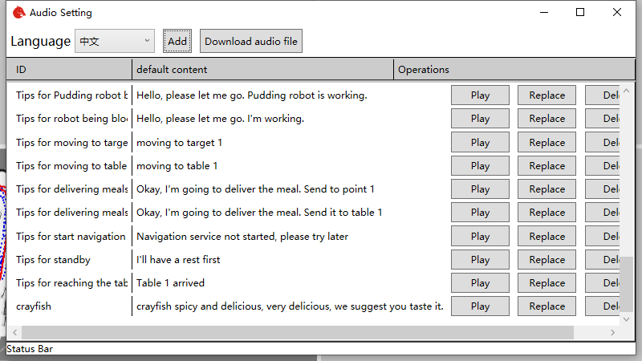

# Chapter4 Audio Editing Tool

## 4.1 Function

Customers can use this software to modify the robot's default audio. It can achieve audio customization, translation, publicity and other effects。

## 4.2 Instructions

Open the software and the UI shows as below.

Click the play button of the corresponding audio to hear the robot say the corresponding words. If you want to modify the default audio, click the replace button, and then select your own audio file. Now only wav and MP3 are supported.

If you want to restore the default audio, you can click the delete button. At this time, the software will delete the user-defined audio and download the default audio from the Internet. So make sure the robot can access the internet.

## 4.3 How to speak other languages

Click languages list, and then we can see languages can be chosen. For example, we want robot to speak English.

After that, according to the previous method to replace the corresponding audio with the English audio file.

## 4.4 Custom audio

Sometimes we want robots to help us promote products through audio. This function can also be implemented by this software.

First, click the Add button in the upper right corner of the main interface to open the add audio dialog box.

Enter what you want the robot to say, like we use it in a restaurant. I want a robot to introduce crayfish to us. You can enter "crayfish" in the name, and then enter the content "crayfish spicy and delicious, very delicious, we suggest you taste it. `

In this way, we can see the newly added crayfish audio at the bottom of the main interface.

Click play to hear the audio introduction. If you are not satisfied with the automatically generated audio, you can also replace it with your own prepared audio file by using the replacement method described earlier.

The added audio can be used in the robot app, which can control the robot to play the corresponding audio circularly. In this way, robots can sell products for you.

The audio settings in app can be referred to [click there](https://doc.bwbot.org/en/books-online/chitu-client-android/sell-product.html)
